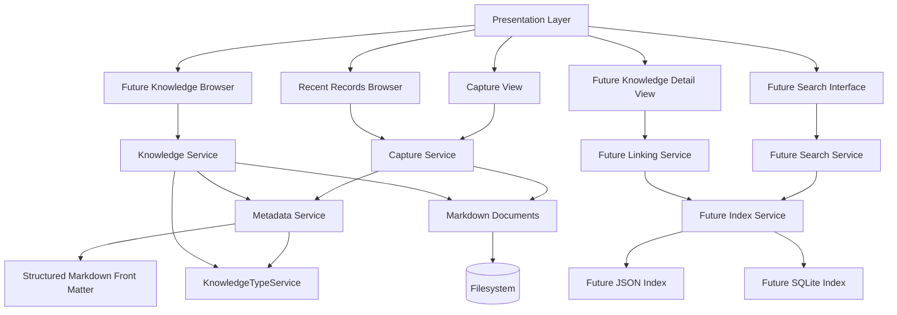

# Architecture

## Milestone 1 — Memory Foundation Architecture

LifeOS currently uses a three-layer separation:

### Presentation Layer
- Tkinter UI
- Multiline text capture view
- Save button
- Recent records browser

### Service Layer
- Capture Service
- Validation and save orchestration

### Storage Layer
- Markdown files on disk

Current responsibilities are kept separate so the UI does not write files directly and the storage layer remains replaceable.

## Milestone 2 — Knowledge Foundation Architecture

Milestone 2 expands LifeOS from simple memory capture into the foundation of a structured personal knowledge system.

### Presentation Layer
- Capture View
- Recent Records Browser
- Future Knowledge Browser
- Future Search Interface
- Future Knowledge Detail View

### Service Layer
- Capture Service
- Knowledge Service
- Metadata Service
- KnowledgeTypeService
- Future Index Service
- Future Search Service
- Future Linking Service

### Storage Layer
- Markdown documents
- Structured Markdown front matter
- Future JSON index
- Future SQLite index

### Architecture Diagram

### Architectural Rules
- Markdown remains the canonical source of truth.
- Metadata must be readable by both humans and software.
- SQLite must not become the canonical content store.
- Search indexes must be rebuildable from Markdown files.
- UI code must not directly read or write Markdown files.
- Knowledge IDs must remain stable.
- Knowledge type values must be validated through the service layer.
- Future AI functionality must consume the service layer rather than directly accessing the UI or storage layer.
- Existing Memory Foundation behavior must remain intact while the knowledge layer is added.
