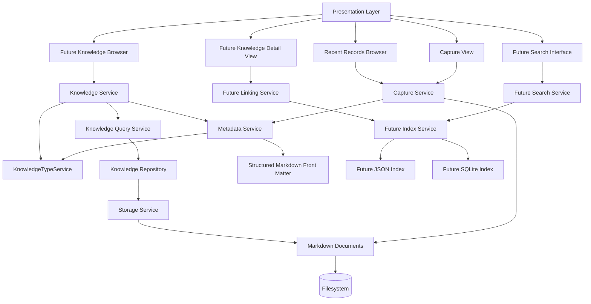

# Architecture

## Milestone 1 — Memory Foundation Architecture

LifeOS currently uses a three-layer separation:

### Presentation Layer
- Tkinter UI
- Multiline text capture view
- Save button
- Recent records browser

### Service Layer
- Capture Service
- Validation and save orchestration

### Storage Layer
- Markdown files on disk

Current responsibilities are kept separate so the UI does not write files directly and the storage layer remains replaceable.

## Milestone 2 — Knowledge Foundation Architecture

Milestone 2 expands LifeOS from simple memory capture into the foundation of a structured personal knowledge system.

### Presentation Layer
- Capture View
- Recent Records Browser
- Future Knowledge Browser
- Future Search Interface
- Future Knowledge Detail View

### Service Layer
- Capture Service
- Knowledge Service
- Knowledge Query Service
- Metadata Service
- KnowledgeTypeService
- Future Index Service
- Future Search Service
- Future Linking Service

### Storage Layer
- Markdown documents
- Structured Markdown front matter
- Future JSON index
- Future SQLite index

### Knowledge Layer Transition

The Knowledge Foundation introduces `KnowledgeService` as the unified entry
point for knowledge operations.

Current runtime path (Milestone 1 baseline):

```text
UI -> Capture Service -> Storage Service -> Markdown
```

Target Knowledge Layer path (Milestone 2 architecture):

```text
UI -> Knowledge Service -> Knowledge Query Service -> Knowledge Repository -> Storage Service -> Markdown
```

`KnowledgeService` centralizes knowledge-level orchestration while preserving
the existing Markdown file format and storage behavior.

### Query Layer

`KnowledgeQueryService` is the read-oriented query boundary for Knowledge
Objects.

- Uses `KnowledgeRepository` only
- Retrieves records by id and list operations
- Applies metadata-based filtering (type, tag, date range)
- Preserves compatibility with legacy Markdown without front matter

### Repository Layer

`KnowledgeRepository` is the persistence boundary for Knowledge Objects.

- Receives persistence requests from `KnowledgeService`
- Delegates file operations to `StorageService`
- Preserves compatibility with existing Markdown files
- Keeps persistence logic out of the service orchestration layer

### Metadata Layer

`MetadataService` defines and manages the standard metadata envelope used by
Knowledge Objects:

- id
- title
- type
- created
- updated
- tags
- source
- version

Metadata is generated and validated in the service layer, then serialized into
Markdown front matter to keep records human-readable and machine-readable.
For backward compatibility, front matter continues to include legacy
`created_at` and `updated_at` aliases.

### Knowledge Type System

`KnowledgeTypeService` validates and canonicalizes metadata type values based on
the shared catalog in `models/knowledge_types.py`.

Standard types:

- journal
- idea
- meeting
- project
- document
- photo
- video
- conversation
- book
- article
- person
- place
- event

Reserved extension examples:

- MineSystem: shipment, inspection, laboratoryreport, vehicle, container
- ICE Studio: character, world, story, scene, dialogue

Compatibility rule:

- Unknown or legacy types remain readable.
- Validation emits a clear warning instead of breaking existing records.
- Legacy aliases are canonicalized where applicable (for example, `memory` -> `journal`).

### Architecture Diagram



### Architectural Rules
- Markdown remains the canonical source of truth.
- Metadata must be readable by both humans and software.
- SQLite must not become the canonical content store.
- Search indexes must be rebuildable from Markdown files.
- UI code must not directly read or write Markdown files.
- Knowledge IDs must remain stable.
- Knowledge type values must be validated through the service layer.
- Future AI functionality must consume the service layer rather than directly accessing the UI or storage layer.
- Existing Memory Foundation behavior must remain intact while the knowledge layer is added.
