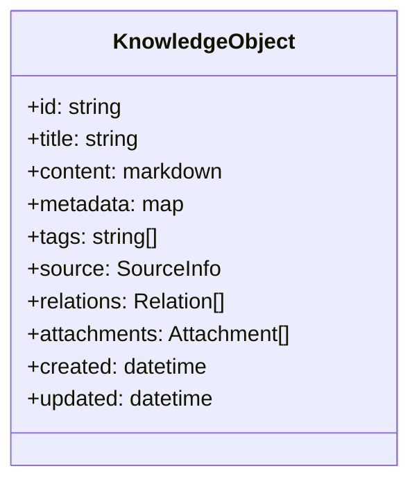
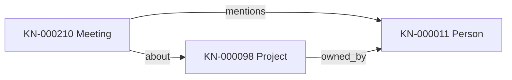
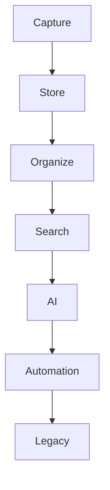
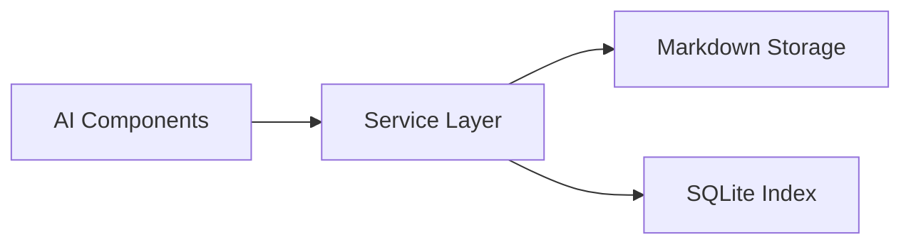
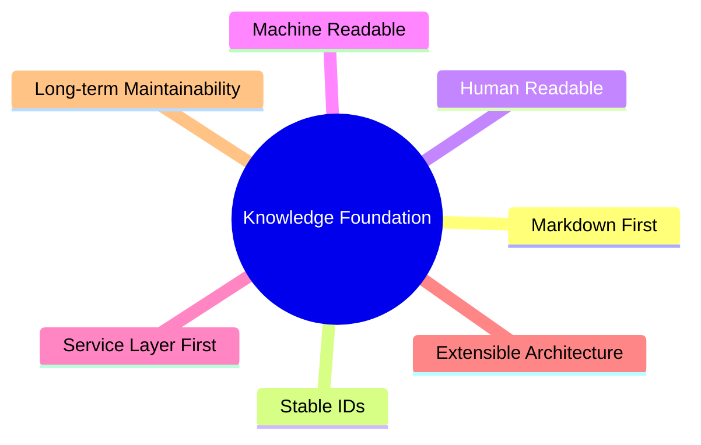

# Knowledge Foundation Architecture

## 1. Vision

LifeOS is designed as a Personal Knowledge and Legacy Platform, not a note-taking application.

A note-taking app optimizes for short-term capture and retrieval of isolated notes.
LifeOS optimizes for long-term continuity of meaning across years and generations.

Core intent:

- Preserve personal knowledge in a durable, portable format.
- Connect knowledge into an evolving personal context.
- Support both human reading and machine processing.
- Build toward legacy transfer, not only daily productivity.

In this model, every piece of information is treated as a stable knowledge asset, not a temporary note.

## 2. Knowledge Object

A Knowledge Object is the standard unit in the Knowledge Foundation.
All knowledge types share the same core structure.

Standard Knowledge Object fields:

- ID: Stable unique identifier, for example KN-000001.
- Title: Human-readable title.
- Content: Primary Markdown body.
- Metadata: Structured attributes in front matter.
- Tags: Topic labels for organization and filtering.
- Source: Origin of the knowledge (manual input, import, transcript, URL, image capture).
- Relations: References to other Knowledge Objects by stable ID.
- Attachments: File references associated with this object.
- Created: Immutable creation timestamp.
- Updated: Latest update timestamp.

Conceptual model:



## 3. Knowledge Metadata

Knowledge Metadata is stored in Markdown front matter.
Front matter is the machine-readable header at the top of a Markdown file.
The Markdown body remains the human-readable narrative.

Front matter example:

```yaml
---
id: KN-000001
title: "Daily Reflection - 2026-07-18"
type: Journal
tags:
  - reflection
  - health
source:
  kind: manual
  channel: desktop
relations:
  - KN-000120
  - KN-000045
attachments:
  - assets/images/reflection-photo-1.jpg
created: 2026-07-18T08:30:00+08:00
updated: 2026-07-18T08:45:10+08:00
---
```

Metadata requirements:

- Must be valid YAML front matter.
- Must include stable id, title, created, and updated.
- Should keep values explicit and predictable for indexing and automation.

## 4. Knowledge ID

Knowledge IDs are stable and never reused.
Format:

- KN-000001
- KN-000002
- KN-000003

Rules:

- ID is assigned once at object creation.
- ID never changes, even if title, type, location, or content changes.
- ID is the canonical reference key across relations, automation, and future graph indexing.

Why IDs must never change:

- Prevent broken references between objects.
- Ensure long-term traceability across exports and migrations.
- Keep automation rules and external integrations reliable.

## 5. Knowledge Types

Knowledge Types classify a Knowledge Object without changing the underlying model.

Standard categories:

- Journal
- Idea
- Book
- Article
- Meeting
- Conversation
- Photo
- Video
- Project
- Person
- Place
- Event
- Document

Examples:

- Journal: personal daily entry.
- Meeting: decision notes with participants and outcomes.
- Person: profile and history about an individual.
- Project: goals, milestones, and related artifacts.

Extension rule:

- New types must extend classification only.
- New types must not alter the core Knowledge Object architecture.

## 6. Knowledge Relations

Knowledge Objects reference each other through stable IDs in the relations field.

Relation example:

- KN-000210 (Meeting) relates to KN-000098 (Project)
- KN-000210 (Meeting) relates to KN-000011 (Person)

Reference structure can evolve from simple ID lists to typed relations.

Future relation model (conceptual):

- relation_type: references, supports, contradicts, follows_up, about
- direction: source object -> target object

Diagram:



## 7. Knowledge Lifecycle

The Knowledge Foundation lifecycle is:

Capture

↓

Store

↓

Organize

↓

Search

↓

AI

↓

Automation

↓

Legacy

Lifecycle diagram:



## 8. Directory Structure

Future Knowledge directory organization should be clear, stable, and scalable.

Proposed structure:

```text
data/
  knowledge/
    inbox/
    journal/
    projects/
    people/
    events/
    media/
    archive/
```

Structure principles:

- Directory placement helps operations and browsing.
- Knowledge identity is determined by stable ID, not path.
- Reorganization of folders must not break references.

## 9. Future SQLite Index

SQLite is planned as an index and query accelerator only.
Markdown files remain the single source of truth.

Scope of SQLite index:

- Fast lookup by id, title, tags, type, and time.
- Search acceleration and relation traversal.
- Caching derived fields for performance.

Non-scope of SQLite index:

- Not the canonical store of primary knowledge content.
- Not a replacement for Markdown storage.

## 10. Future AI Integration

AI access must go through the Service Layer.
AI does not read or mutate storage directly.

Service Layer responsibilities:

- Authorization and policy checks.
- Structured retrieval by ID, type, relation, and filters.
- Controlled write/update operations.
- Auditability of AI-triggered operations.

Architecture diagram:



## 11. Future Knowledge Graph

Long-term, Knowledge Objects and Relations can be materialized as a graph representation.

Graph direction:

- Nodes: Knowledge Objects.
- Edges: typed relationships between object IDs.
- Properties: metadata fields, timestamps, tags, and source attributes.

Graph goals:

- Context-aware retrieval.
- Better reasoning over connected knowledge.
- Explainable relation paths for AI outputs.

Graph is a computed representation, not the primary source.
Primary source remains Markdown Knowledge Objects.

## 12. Design Principles

Knowledge Foundation is guided by the following principles:

- Markdown First: Markdown is the canonical storage format.
- Stable IDs: IDs are immutable and globally referenceable.
- Human Readable: Content stays understandable without specialized tools.
- Machine Readable: Metadata and structure support indexing and automation.
- Service Layer First: Access goes through services, not direct storage coupling.
- Extensible Architecture: Types and relations can expand without core rewrites.
- Long-term Maintainability: Design favors durability, portability, and migration safety.

Principle map:



---

This document defines the architectural baseline for Milestone 2: Knowledge Foundation.
Implementation should follow this architecture without changing current Markdown storage as the source of truth.
