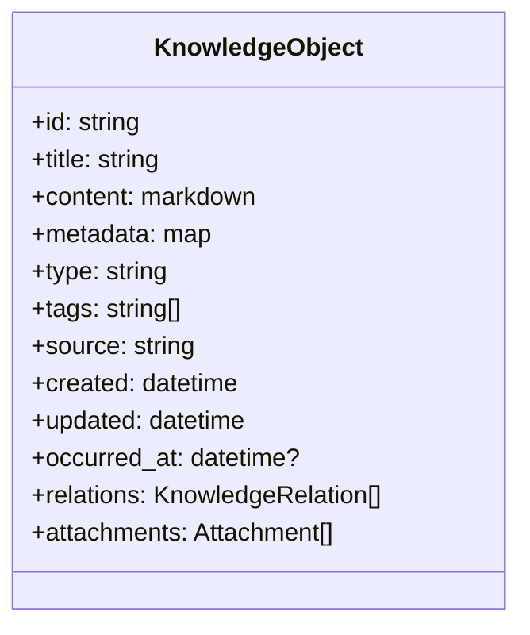
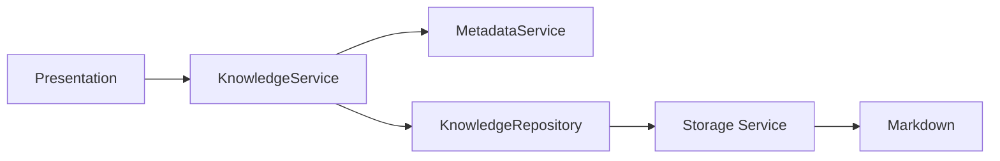
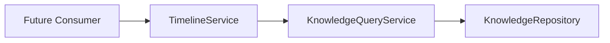
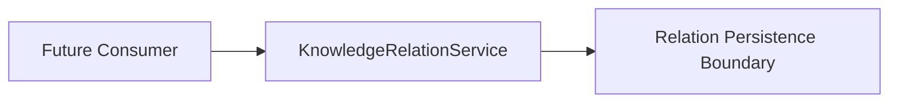

# Milestone 2 Knowledge Foundation Closure

## 1. Milestone Overview

Milestone 2 transformed LifeOS from a Markdown memory capture application into a structured Knowledge Foundation with clear service boundaries, metadata standards, and platform-oriented models.

Completed abilities:

- Ability-0006 Knowledge Service
- Ability-0007 Knowledge Metadata
- Ability-0008 Knowledge Repository
- Ability-0009 Knowledge Query
- Ability-0010 Knowledge Types
- Ability-0011 Knowledge Relations
- Ability-0012 Timeline Foundation

## 2. Current Knowledge Object Model

Current conceptual Knowledge Object:

- stable ID
- title
- content
- metadata
- type
- tags
- source
- created time
- updated time
- occurred time
- relations
- future attachments

## 3. Layer Responsibilities

Layer responsibilities:

- Presentation Layer: user interaction and view rendering only.
- KnowledgeService: orchestration entry point for knowledge operations.
- MetadataService: metadata creation, validation, and front matter serialization.
- KnowledgeTypeService: type normalization, canonicalization, and compatibility warnings.
- KnowledgeRelationService: relation rule validation and relation operations.
- TimelineService: temporal normalization, fallback resolution, sorting, filtering, grouping.
- KnowledgeQueryService: read/query operations over knowledge records.
- KnowledgeRepository: persistence boundary for knowledge records.
- Storage Service: file I/O for Markdown records.
- Markdown files: canonical persisted knowledge data.

Allowed call boundaries:

- Presentation Layer -> KnowledgeService.
- KnowledgeService -> MetadataService, KnowledgeTypeService, KnowledgeQueryService, KnowledgeRelationService, TimelineService, KnowledgeRepository.
- TimelineService -> KnowledgeQueryService.
- KnowledgeQueryService -> KnowledgeRepository.
- KnowledgeRepository -> Storage Service.
- Storage Service -> Markdown files.

Disallowed boundaries:

- Presentation Layer -> Storage Service.
- UI -> Repository direct access.
- TimelineService -> Storage Service direct access.
- Query or service logic bypassing Repository.

## 4. End-to-End Data Flow

### A. Creating Knowledge

Presentation -> KnowledgeService -> MetadataService -> KnowledgeRepository -> Storage Service -> Markdown

### B. Querying Knowledge

Presentation or future consumer -> KnowledgeService -> KnowledgeQueryService -> KnowledgeRepository -> Storage Service -> Markdown

### C. Timeline Processing

Future consumer -> TimelineService -> KnowledgeQueryService -> KnowledgeRepository

### D. Relation Processing

Future consumer -> KnowledgeRelationService -> relation persistence boundary

## 5. Source of Truth

- Markdown remains the source of truth.
- SQLite may later serve only as an index or cache.
- AI must not become the source of truth.
- Human-readable data must remain recoverable without LifeOS.

## 6. Backward Compatibility

Existing Markdown files remain readable even when they do not contain:

- stable IDs
- standardized types
- relations
- occurred_at

Compatibility policy:

- Unknown metadata fields are preserved.
- Unknown type/relation values may emit warnings but are still readable.
- Automatic destructive migration is prohibited.
- Historical Markdown files are not rewritten automatically.

## 7. Platform Candidate Review

| Capability | Current LifeOS implementation | Platform reuse potential | Validation status | Extraction decision |
| --- | --- | --- | --- | --- |
| Stable ID | Metadata-generated stable IDs persisted in Markdown | High | Validated in core flows | Candidate for future shared Platform |
| Metadata | Structured front matter with validation and compatibility aliases | High | Validated in capture/query flows | Candidate for future shared Platform |
| Repository | Dedicated persistence boundary wrapping storage operations | High | Validated | Keep inside LifeOS for continued validation |
| Query | Dedicated query service with filtering and normalization | High | Validated | Keep inside LifeOS for continued validation |
| Types | Canonical type catalog with compatibility aliases/warnings | High | Validated | Candidate for future shared Platform |
| Relations | Generic relation model and service, persistence deferred | Medium-High | Partially validated (service/model level) | Not ready for extraction |
| Timeline | Time model and timeline service over query boundaries | High | Validated (service level) | Keep inside LifeOS for continued validation |
| Markdown storage | Canonical, human-readable persistence format | High | Validated | Product-specific (with reusable conventions) |

No code extraction is performed in Architecture Sprint-002.

## 8. Cross-Product Validation

Architectural validation examples:

- LifeOS: journals, conversations, photos, personal events.
- MineSystem: shipment records, vehicles, containers, inspections, operational timestamps.
- ICE Studio: stories, scenes, characters, worlds, fictional chronology.

These are architectural validation examples only.
LifeOS must not depend on MineSystem or ICE Studio.

## 9. Deferred Capabilities

Milestone 2 does not implement:

- Full-text search
- Semantic search
- SQLite index
- AI memory
- Embeddings
- Knowledge Graph visualization
- Timeline UI
- Life Map
- EXIF extraction
- GPS extraction
- cloud synchronization
- relation persistence if not yet fully integrated
- automatic historical migration

## 10. Milestone Acceptance Criteria

Milestone 2 closure criteria:

- all existing tests pass
- application starts successfully
- existing capture and browsing behavior remains unchanged
- architectural boundaries are documented
- no database dependency introduced
- no AI dependency introduced
- Markdown remains source of truth
- backward compatibility preserved

## 11. Milestone 3 Entry Conditions

Search Foundation may start only when Search:

- accesses knowledge through service/query boundaries
- does not bypass Repository
- does not make SQLite the source of truth
- preserves Markdown compatibility
- separates exact filtering from full-text search
- remains replaceable and extensible

## 12. Architecture Decision Summary

Key Milestone 2 decisions:

- Service Layer First
- Repository Pattern
- Query Separation
- Metadata First
- Stable IDs
- Extensible Types
- Generic Relations
- occurred_at distinct from created_at
- Platform candidates remain inside LifeOS until sufficiently validated

## 13. Completion Statement

Milestone 2 Knowledge Foundation is architecturally closed and is ready for Milestone 3 only after this document is reviewed.

## Appendix: Consistency Review Notes

Reviewed references:

- docs/MasterPlan.md
- docs/Architecture.md
- docs/KnowledgeArchitecture.md
- docs/Roadmap.md

Note:

- Constitution.md was not found in the current repository at review time.
